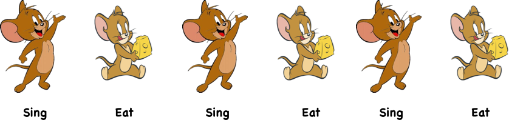

# What is Parallel and Concurrency ?

apa itu parallel dan concurrency? mari kita bayangkan penjelasan tentang hal ini dengan
skenario dalam pesta.

Bayangkan anda sedang berada di dalam pesta dan anda ditantang oleh teman anda untuk memakan keju dan menari.
Apa yang akan anda lakukan? apakah anda akan memakan keju tersebut selagi menari atau bagaimana?

## Concurrent

Jika anda ingin menggunakan metode ini anda mungkin akan memakan keju anda terlebih dahulu hingga setengah, lalu menari
setelah itu lanjut memakan keju lalu menari lagi, mungkin saat anda memakan keju yang ke 10 anda belum selesai mengunyah anda 
mulai menari Atau saat tarian anda belum selesai anda mulai memakan sisa keju yang belum termakan, itulah yang disebut concurrency
Kegiatan2 yang anda lakukan bisa terjadi pada waktu yang tumpang tindih walaupun waktu mulai dan selesainya tidak sama, anda tidak
perlu terus memakan keju tersebut sampai habis sambil menari tetapi anda bisa sedikit2 memakan keju sambil menari untuk menghemat waktu anda.

 

## Parallel

Sekarang bayangkan aturan pesta tersebut ditambah, anda harus menyelesaikan makan dan menari pada waktu yang sama. Anda bingung karena tidak mungkin
anda akan makan dan menari pada saat yang bersamaan, lalu untungnya panitia memberikan kelonggaran, anda boleh meminta bantuan Akhirnya!!. Anda akhirnya
meminta bantuan teman anda untuk membagi2 tugas, Anda akan memakan keju (karena anda suka keju) sedangkan teman anda akan menari (karena dia memiliki gerakan yang bagus)
Bravo!! anda dan teman anda berhasil memakan 2 keju swiss dan menari selama 10 menit dengan waktu mulai dan berhenti yang sama (walaupun bukan anda yang makan dan menari
secara bersamaan). Itu lah yang dinamakan parallelism, ketika tugas2 dibagi menjadi tugas2 yang lebih kecil dan dikerjakan secara bersamaan. Dengan konsep ini
anda dapat mengerjakan tugas yang sulit secara mudah dan dengan waktu yang singkat, tetapi kerugiannya adalah anda perlu beberapa orang untuk mengerjakan tugas ini
sekarang.

nah sekarang anda sudah tahu 2 metode untuk menyelesaikan tugas anda, lalu metode mana yang akan anda pilih ?

1. Concurrency, yang tidak perlu banyak orang namun waktu yang lebih lambat
2. Parallelism, waktu penyelesaian yang seragam namun butuh orang yang banyak
